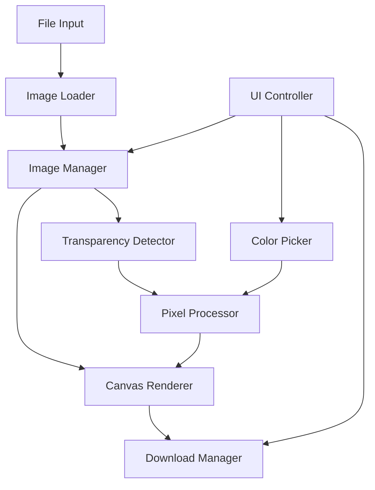

# Design Document

## Overview

透明ピクセル塗りつぶしツールは、HTML5 Canvas APIとJavaScriptを使用したクライアントサイドWebアプリケーションです。ユーザーが複数の画像をアップロードし、透明ピクセルを検知して指定した色で塗りつぶす機能を提供します。

### Key Technologies
- HTML5 Canvas API for image manipulation
- File API for image upload handling
- ImageData API for pixel-level operations
- Color picker input for user color selection
- CSS for responsive UI design

## Architecture

### System Architecture


### Component Interaction Flow
1. User uploads multiple images via File Input
2. Image Loader validates and loads images
3. Image Manager stores and manages multiple images
4. Canvas Renderer displays current image
5. Transparency Detector analyzes alpha channel
6. User selects color via Color Picker
7. Pixel Processor fills transparent areas
8. Download Manager exports processed image

## Components and Interfaces

### 1. ImageManager Class
```javascript
class ImageManager {
  constructor()
  addImages(files: FileList): Promise<void>
  getCurrentImage(): HTMLImageElement
  switchToImage(index: number): void
  getImageCount(): number
  getImageList(): Array<{id: string, name: string, thumbnail: string}>
  reset(): void
}
```

### 2. TransparencyDetector Class
```javascript
class TransparencyDetector {
  detectTransparentPixels(imageData: ImageData): Array<{x: number, y: number}>
  hasTransparency(imageData: ImageData): boolean
  getTransparencyMask(imageData: ImageData): Uint8Array
}
```

### 3. PixelProcessor Class
```javascript
class PixelProcessor {
  fillTransparentPixels(imageData: ImageData, fillColor: {r: number, g: number, b: number}): ImageData
  applyColorToTransparentAreas(canvas: HTMLCanvasElement, color: string): void
  preserveOriginalPixels(imageData: ImageData): ImageData
}
```

### 4. CanvasRenderer Class
```javascript
class CanvasRenderer {
  constructor(canvasElement: HTMLCanvasElement)
  drawImage(image: HTMLImageElement): void
  getImageData(): ImageData
  putImageData(imageData: ImageData): void
  clear(): void
  resize(width: number, height: number): void
}
```

### 5. UIController Class
```javascript
class UIController {
  constructor()
  setupEventListeners(): void
  handleFileUpload(files: FileList): void
  handleImageSwitch(imageIndex: number): void
  handleColorChange(color: string): void
  updateImageList(images: Array): void
  showError(message: string): void
  showSuccess(message: string): void
}
```

## Data Models

### Image Data Structure
```javascript
interface ProcessedImage {
  id: string;
  originalFile: File;
  imageElement: HTMLImageElement;
  originalImageData: ImageData;
  processedImageData: ImageData;
  hasTransparency: boolean;
  transparentPixels: Array<{x: number, y: number}>;
  currentFillColor: string;
  thumbnail: string;
}
```

### Application State
```javascript
interface AppState {
  images: Map<string, ProcessedImage>;
  currentImageId: string | null;
  currentFillColor: string;
  isProcessing: boolean;
  errorMessage: string | null;
}
```

## Error Handling

### File Upload Errors
- Invalid file format: Display user-friendly error message
- File size too large: Warn user and suggest compression
- File corruption: Handle gracefully with error notification
- Multiple file processing: Continue with valid files, report invalid ones

### Canvas Processing Errors
- Canvas size limitations: Automatically resize if needed
- Memory constraints: Implement progressive processing for large images
- Browser compatibility: Provide fallback messages for unsupported browsers

### Image Processing Errors
- Invalid image data: Validate ImageData before processing
- Color conversion errors: Use safe color parsing with defaults
- Transparency detection failures: Provide manual override options

## Testing Strategy

### Unit Testing
- ImageManager: Test image loading, switching, and state management
- TransparencyDetector: Test alpha channel detection accuracy
- PixelProcessor: Test color filling algorithms with various scenarios
- CanvasRenderer: Test drawing and data manipulation operations

### Integration Testing
- File upload to canvas rendering pipeline
- Color picker to pixel processing workflow
- Image switching with state preservation
- Download functionality with different image formats

### User Acceptance Testing
- Upload multiple images of different formats
- Switch between images and verify state preservation
- Apply different colors and verify visual results
- Download processed images and verify quality
- Test error scenarios (invalid files, large images)

### Performance Testing
- Large image processing (>10MB files)
- Multiple image handling (10+ images)
- Real-time color preview responsiveness
- Memory usage monitoring during extended use

## Implementation Notes

### Canvas Optimization
- Use requestAnimationFrame for smooth UI updates
- Implement image scaling for large files to improve performance
- Cache processed ImageData to avoid recomputation

### Browser Compatibility
- Target modern browsers with Canvas API support
- Provide progressive enhancement for older browsers
- Test across Chrome, Firefox, Safari, and Edge

### User Experience
- Show loading indicators during processing
- Provide visual feedback for transparent areas
- Implement keyboard shortcuts for common actions
- Ensure responsive design for mobile devices